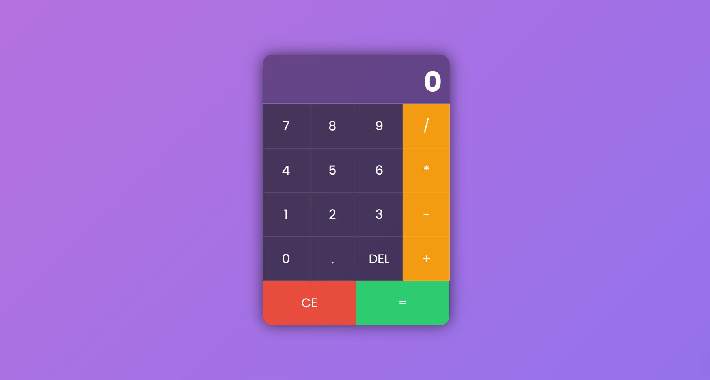

# 🎨 Kalkulator Modern Sederhana

Sebuah kalkulator web modern yang dibuat menggunakan **HTML**, **CSS (TailwindCSS)**, dan **JavaScript** dengan tampilan estetis dan fitur interaktif seperti:

- 🔢 Perhitungan dasar (tambah, kurang, kali, bagi)
- 🌀 Tampilan background yang berganti warna
- 🎵 Efek suara klik tombol
- 📱 Responsif dan mendukung input keyboard
- 🔠 Ukuran font otomatis menyesuaikan jumlah digit
- ⬆️ Animasi ekspresi saat operator ditekan (fitur lanjutan)
- 💥 Deteksi pembagian dengan nol (tidak menampilkan Infinity)

---

## 🚀 Demo



https://izzatmumtaz.github.io/Web-Calculatorr/

---

## 🛠️ Teknologi

- **HTML5**
- **TailwindCSS** untuk styling
- **Vanilla JavaScript** untuk logika dan animasi
- **Custom Sound Effect** untuk interaksi tombol

---

## 📦 Struktur Project

```bash
.
├── index.html          # File utama HTML
├── style.css           # CSS tambahan (jika ada)
├── script.js           # Logika kalkulator
├── click.mp3           # Suara klik tombol
├── preview.png         # Gambar preview kalkulator
└── README.md           # Dokumentasi project ini
